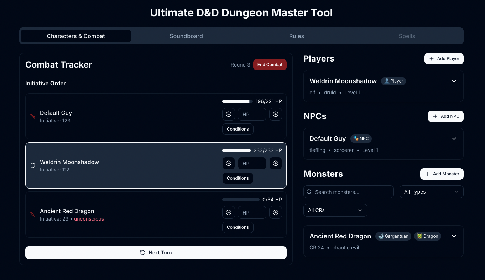

# Ultimate D&D Dungeon Master Tool

A comprehensive web application designed to streamline Dungeons & Dragons gameplay for Dungeon Masters. This tool combines essential DM features into a single, easy-to-use interface.


## Features

### Characters & Combat Management
- **Character Tracker**: Keep track of player characters' key stats and information
- **Monster Reference**: Quick access to monster stats and information
- **Combat Tracker**: 
  - Initiative tracking
  - HP management
  - Status effect monitoring
  - Turn order management



### Interactive Soundboard
- Quick access to ambient sounds and music
- Customizable sound effects for combat and roleplay
- Easy-to-use interface for managing audio during sessions


### Quick Rules Reference
- Fast access to commonly used D&D 5e rules
- Organized by categories:
  - Actions
  - Movement
  - Combat
  - Environment
  - Conditions
- Searchable interface
- Mobile-friendly design for quick lookups during gameplay


### Coming Soon
- **Spell Database**: Comprehensive spell reference and management
- More features planned...

## Technology Stack
- Next.js 14 (App Router)
- React
- TypeScript
- Tailwind CSS
- Radix UI
- Zustand (State Management)

## Getting Started

1. Clone the repository:
```bash
git clone https://github.com/yourusername/dnd-dm-tool.git
```

2. Install dependencies:
```bash
npm install
```

3. Run the development server:
```bash
npm run build
npm run start
```

4. Open [http://localhost:3000](http://localhost:3000) with your browser

## Contributing

Contributions are welcome! Please feel free to submit a Pull Request. For major changes, please open an issue first to discuss what you would like to change.

## Acknowledgments

- Built using the Next.js framework
- UI components from Radix UI
- Icons and emojis for intuitive navigation
- D&D 5e SRD for rule references

## Support

If you encounter any issues or have questions, please file an issue on the GitHub repository.

---

This project is not affiliated with Wizards of the Coast or the official Dungeons & Dragons brand.
